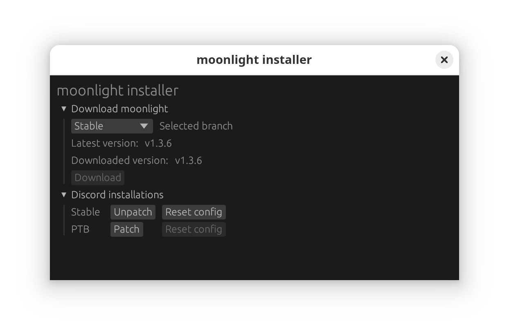

# moonlight-installer

A desktop application to install [moonlight](https://github.com/moonlight-mod/moonlight).

## Installation

Go to the [latest release](https://github.com/moonlight-mod/moonlight-installer/releases/latest) and download the appropriate file for your system.

Nightly builds on GitHub Actions can be found [here](https://github.com/moonlight-mod/moonlight-installer/actions/workflows/build.yml). You will need a GitHub account.

## Known issues

- Linux installations are only detected if they are in `~/.local/share`.
  - Temporary fix: use `MOONLIGHT_DISCORD_SHARE_LINUX` in place of `~/.local/share` and moonlight will scan there.
